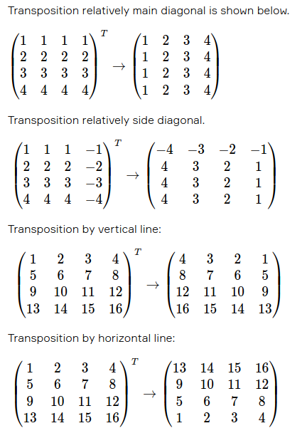

# Numeric_Matrix_Processor
### This is a console program which performs various operations on matrices. User provides a number in order to choose corresponding operation from the displayed menu. Program offers the following operations:
#### 1. Add matrices - this operation adds two matrices and displays the resulting matrix. Program expects from the user to provide valid size of the first matrix (number of rows and columns separated by space which are integer numbers not less than 1, if not provided correctly than program repeat the prompt). After providing the matrix size, program expects to provide the matrix itself. Each row must be provided in separate line in console. Each line consists of numbers separated by space. If user provides input which is not a number or provided matrix does not match the provided size than message will be displayed and program will repeat prompt to provide the matrix. After successfully provided size and matrix the same procedure is repeat for the second matrix. If both matrices has the same size than program will display resulting matrix. Otherwise it will display error message.
#### 2. Multiply matrix to a constant - this operation multiplies matrix by a constant number and displays the resulting matrix. Program expects to provide valid matrix (the same requirements as in point #1) and valid constant (some number). If constant is incorrect program will repeat the prompt.
#### 3. Multiply matrices - this operation multiplies first matrix by the second one. After providing two valid matrices, program checks if number of columns in the first matrix is the same as number of rows in the second matrix. If requirement is met, program displays resulting matrix. Otherwise operation is impossible and error message is displayed.
#### 4. Transpose matrix - this operation displays submenu
#### 4.1 Main diagonal - this operations performs matrix transposition relatively main diagonal and displays resulting matrix
#### 4.2 Side diagonal - this operations performs matrix transposition relatively side diagonal and displays resulting matrix
#### 4.3 Vertical line - this operations performs matrix transposition by vertical line and displays resulting matrix
#### 4.4 Horizontal line - this operations performs matrix transposition by horizontal line and displays resulting matrix

#### 5. Calculate a determinant - this operation calculates the determinant for the provided matrix and displays the result (a single number)
#### 6. Inverse matrix - this operation finds inverse matrix for the provided matrix and displays it. Provided matrix must be a square matrix